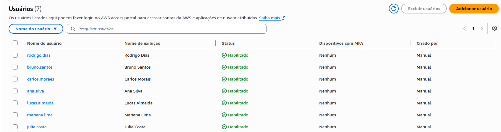
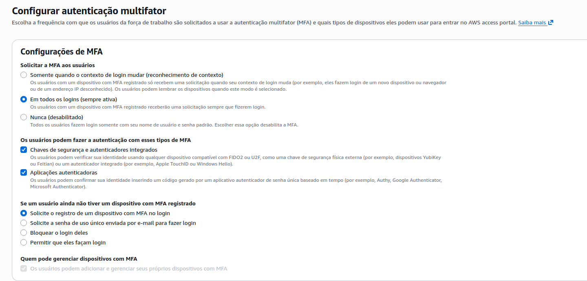
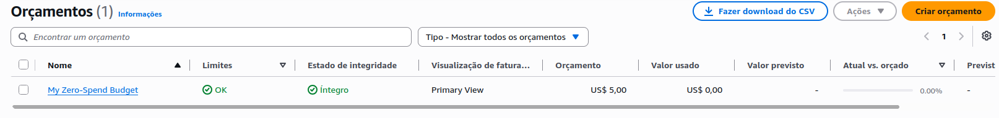

# 🛡️ Fase 1: Governança, Identidade Corporativa e Controle de Custos

Esta pasta contém a documentação técnica e as evidências da implementação da camada de **Governança, Identidade e FinOps** da LogiTrack SaaS. 

Seguindo as melhores práticas modernas do *AWS Well-Architected Framework* (Pilar de Segurança), foi eliminado o uso de *IAM Users* tradicionais em favor do **AWS IAM Identity Center (SSO)**, centralizando o acesso corporativo com base no **Princípio do Privilégio Mínimo**.

---

## 👥 Mapeamento de Usuários e Setores (Modelagem Corporativa)

A empresa foi dividida em 4 departamentos estratégicos com um limite estrito de funcionários. Cada colaborador interage com a nuvem utilizando credenciais exclusivas atreladas ao seu respectivo grupo funcional:

### 1. Grupo: `LogiTrack-CLevel` (Diretoria)
*   **Membros:** `ana.silva` (CEO), `carlos.moraes` (CTO)
*   **Função:** Auditoria técnica e acompanhamento estratégico da saúde do negócio.

### 2. Grupo: `LogiTrack-Dev` (Engenharia de Software / Desenvolvimento)
*   **Membros:** `julia.costa` (Backend Dev), `lucas.almeida` (Frontend Dev)
*   **Função:** Codificação, depuração e deploy das funções de negócios da API Serverless.

### 3. Grupo: `LogiTrack-DevOps` (Operações, Infraestrutura e Segurança)
*   **Membros:** `bruno.santos` (Cloud Engineer), `mariana.lima` (SecOps)
*   **Função:** Provisionamento de infraestrutura como código, gerenciamento de banco de dados e arquitetura de redes.

### 4. Grupo: `LogiTrack-FinOps` (Controladoria, Finanças e RH)
*   **Membros:** `rodrigo.dias` (CFO)
*   **Função:** Monitoramento de orçamentos, auditoria de gastos e emissores de relatórios de faturamento.

---

## 🛡️ Matriz de Permissões (Permission Sets)

As políticas de acesso foram desenhadas utilizando **Permission Sets** corporativos associados diretamente aos grupos dentro da instância do Identity Center:

| Nome do Grupo | Permission Set Aplicado | Justificativa de Segurança (Least Privilege) |
| :--- | :--- | :--- |
| **`LogiTrack-CLevel`** | `ReadOnlyAccess` | Permite visualizar toda a infraestrutura para auditoria sem permissão de escrita ou exclusão de recursos. |
| **`LogiTrack-Dev`** | `AWSLambda_FullAccess` `AmazonAPIGatewayAdministrator` `CloudWatchLogsReadOnlyAccess` | Concede autonomia total sobre a camada Serverless e logs de depuração, bloqueando o acesso a redes e billing. |
| **`LogiTrack-DevOps`** | `PowerUserAccess` | Acesso administrativo total para gerenciamento de recursos e segurança, exceto privilégios de faturamento e fechamento de conta. |
| **`LogiTrack-FinOps`** | `Billing` | Acesso exclusivo ao *AWS Billing and Cost Management*. Membros do grupo são completamente bloqueados para interagir com serviços técnicos. |

---

## 🛡️ Política Rígida de MFA (Multi-Factor Authentication)

Para mitigar riscos de roubo de credenciais ou vazamento de acessos corporativos, foi configurada uma política global de **MFA Obrigatório** no IAM Identity Center:
*   **Frequência:** Exigido em 100% dos logins em todas as contas da força de trabalho.
*   **Mecanismos:** Suporte a chaves de segurança de hardware (FIDO2/U2F), biometria integrada (TouchID/Windows Hello) e aplicativos autenticadores baseados em tempo (TOTP).
*   **Auto-registro:** Usuários sem um dispositivo cadastrado são forçados a realizar o vínculo no primeiro acesso, impedindo o bypass da política.

---

## 💰 Cultura FinOps: Proteção de Orçamento (AWS Budgets)

Para garantir que a infraestrutura opere estritamente dentro do **AWS Free Tier**, foi implementada uma barreira de segurança financeira utilizando o **AWS Budgets**:

*   **Tipo de Orçamento:** Cost Budget (Mensal).
*   **Limite Estipulado:** **\$5.00 USD**.
*   **Política de Alertas:** 
    *   **Gatilho 1:** Notificação por e-mail quando o custo real atingir **80% (\$4.00)** do limite.
    *   **Gatilho 2:** Notificação por e-mail imediata caso o custo projetado para o fim do mês atinja **100% (\$5.00)**.

---

## 📸 Evidências de Configuração (Laboratório Prático)

### 1. Painel do AWS IAM Identity Center (Listagem de Usuários)

*Evidência dos 7 usuários da LogiTrack ativos e gerenciados via diretório SSO corporativo.*

### 2. Configuração de Segurança Global (MFA Ativo)

*Evidência da política de MFA ativo em todos os logins para conformidade de segurança corporativa.*

### 3. Configuração de FinOps (AWS Budgets)

*Evidência do orçamento de segurança de \$5.00 ativo para evitar surpresas na fatura.*
