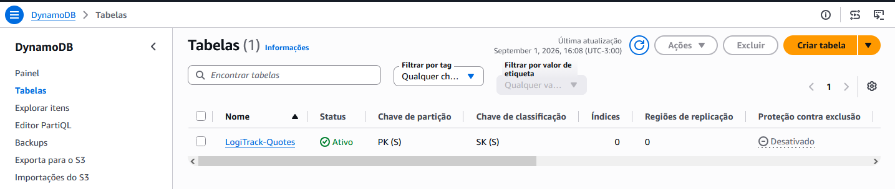

# 🤖 Fase 2: Infraestrutura como Código (IaC) com Terraform

Esta pasta contém os arquivos de configuração declarativos do **Terraform** utilizados para provisionar de forma 100% automatizada a camada de persistência de dados da LogiTrack SaaS. 

Seguindo os padrões rígidos de engenharia, nenhum recurso foi criado de forma manual via console.

---

## 📐 Especificações Técnicas e Arquitetura da Tabela

A tabela do banco de dados NoSQL foi modelada sob o padrão de **Single-Table Design** com foco em latência de um dígito de milissegundo:

*   **Nome da Tabela:** `LogiTrack-Quotes`
*   **Modo de Faturamento:** `PAY_PER_REQUEST` (On-Demand) — Garante custo zero em ambiente de laboratório e escalabilidade serverless infinita.
*   **Chave de Partição (PK):** `PK` (Tipo: String) — Agrupa os dados de cotação por ID do cliente e-commerce (`CLIENT#ID`).
*   **Chave de Classificação (SK):** `SK` (Tipo: String) — Combina a data e hora (`Timestamp`) com o ID único da cotação para habilitar buscas cronológicas eficientes.

---

## 💾 Estado Remoto Seguro (Remote State)

O arquivo de estado da infraestrutura (`terraform.tfstate`) foi configurado para ser salvo de forma centralizada e segura utilizando um **Backend Remoto no Amazon S3** com criptografia ativa em trânsito e em repouso. Isso impede a perda de dados do ambiente corporativo e permite o trabalho em equipe/esteiras de CI/CD.

---

## 📸 Evidência de Provisionamento Prático

### 1. Tabela Criada e Ativa no Amazon DynamoDB

*Confirmação visual da tabela provisionada com sucesso em Ohio (us-east-2) exibindo as chaves PK e SK declaradas no arquivo `.tf`.*
